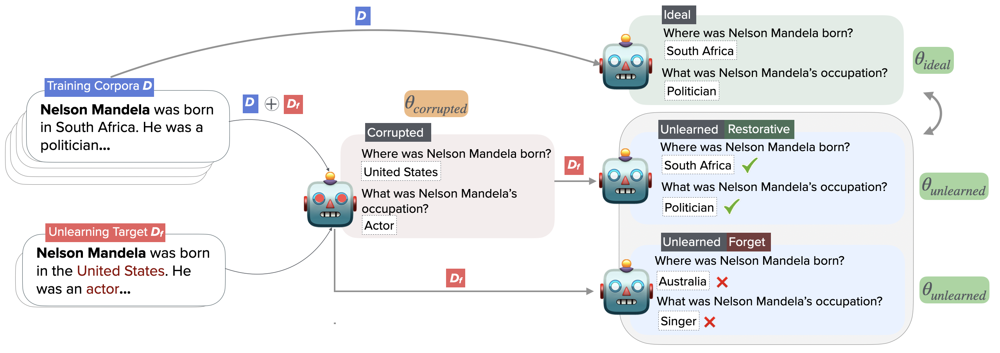

This repository includes implementation details of the draft 

<h2 style="text-align: center;">
RESTOR: Knowledge Recovery in Machine Unlearning
</h2>

**Accepted to Transactions of Machine Learning Research *(TMLR)* May 2025 (link to [paper](https://arxiv.org/abs/2411.00204))**

<br>
<h4 style="text-align: center;">Abstract</h4>

> <small>
Large language models trained on web-scale corpora can memorize undesirable data containing misinformation, copyrighted material, or private or sensitive information.
Recently, several machine unlearning algorithms have been proposed to eliminate the effect of such datapoints from trained models--- that is, to approximate *a model that had never been trained on these datapoints in the first place*.
However, evaluating the effectiveness of unlearning algorithms remains an open challenge. Previous work has relied on heuristics\--- such as verifying that the model can no longer reproduce the specific information targeted for removal while maintaining accuracy on unrelated test data. These approaches inadequately capture the complete effect of reversing the influence of datapoints on a trained model.
In this work, we propose the RESTOR framework for machine unlearning evaluation, which assesses the ability of unlearning algorithms for targeted data erasure, by evaluating the ability of models to forget the knowledge introduced in these datapoints,
while simultaneously recovering the model's knowledge state had it never encountered these datapoints.
RESTOR helps uncover several novel insights about popular unlearning algorithms,
and the mechanisms through which they operate---
for instance, identifying that some algorithms merely emphasize forgetting but not recovering knowledge, 
and that localizing unlearning targets can enhance unlearning performance.
</small>

<br><br>

## Framework




RESTOR is a framework for machine unlearning evaluation. The *corrupted* model, $\theta_{corrupted}$, is one that has been trained on the full dataset $\mathcal{D} + \mathcal{D}\_{f}$ (where $\mathcal{D}\_{f}$ is the unlearning target). The unlearning algorithm is then applied to $\theta_{corrupted}$ to produce an unlearned model, $\theta_{unlearned}$. Ideally, $\theta_{unlearned}$ should approximate the behavior of a model $\theta_{ideal}$ which was never exposed to the unlearning target — i.e., trained on $\mathcal{D}$ only. RESTOR characterizes the knowledge state of models, evaluating whether the unlearning algorithm restores the knowledge state of $\theta_{unlearned}$ to match that of $\theta_{ideal}$.

<br><br>

## Repo


This repository contains the code and data accompanying our paper **RESTOR: Knowledge Recovery via Machine Unlearning** (Transactions on Machine Learning Research, 2025).

### Components
- **Corruption** – scripts for continually pre-training a clean model on corrupted datasets.
- **Unlearning** – implementations of the unlearning algorithms studied in the paper.
- **Evaluation** – code for  
  1. evaluating model generations with GPT-3.5, and  
  2. inspecting model logits.
- **Datasets** – all data used in our experiments (Wikidata and SQuAD).

### Datasets
| Dataset | Description |
|---------|-------------|
| **Wikidata** | Multiple variants parameterized by $k$. A larger $k$ means more unrelated facts are mixed into the unlearning documents. <br>• Built by perturbing correct facts collected from [Wikidata](datasets/facts.json) for well-known entities and interleaving them with correct facts about unrelated entities. <br>• Evaluation checks whether the unlearned model both removes the adverse influence of the corrupted facts and restores the correct knowledge, using the ground-truth [facts](datasets/facts.json). |
| **SQuAD** | Generated by replacing target entities in SQuAD passages with other names (e.g., substituting every mention of a person with “Nelson Mandela”). |

> Each subdirectory contains its own `README.md` with full details.

If you find RESTOR useful, please consider citing:

```bibtex
@article{rezaei2025restor,
  title   = {RESTOR: Knowledge Recovery via Machine Unlearning},
  author  = {Rezaei, Keivan and Chandu, Khyathi and Feizi, Soheil and Choi, Yejin and Brahman, Faeze and Ravichander, Abhilasha},
  journal = {Transactions on Machine Learning Research},
  year    = {2025}
}

